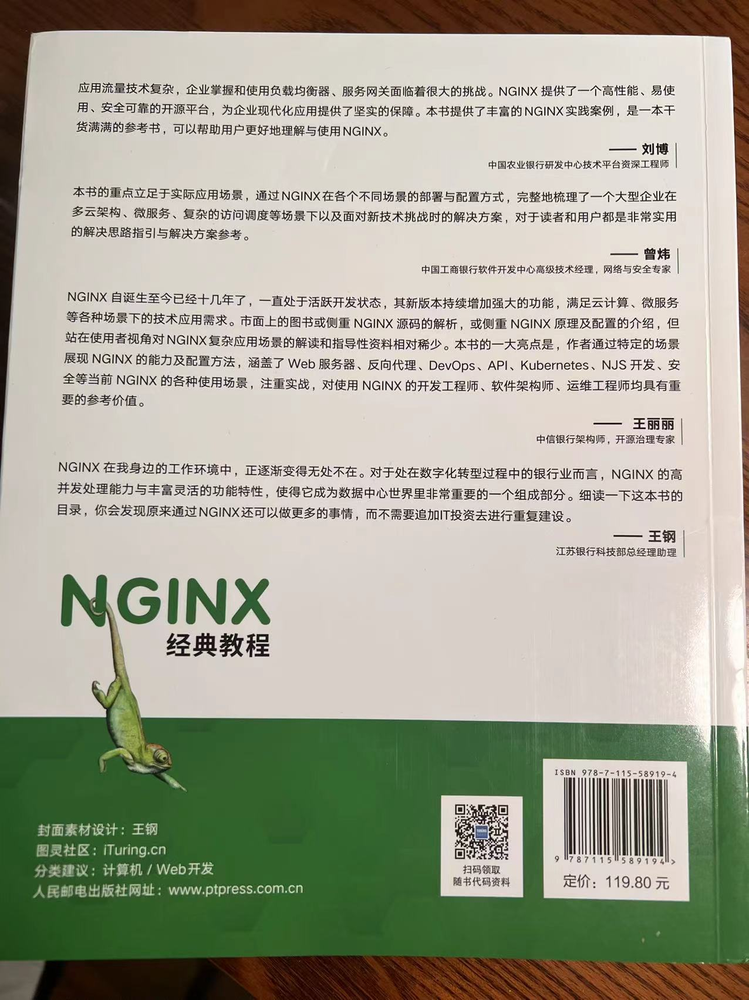

### This is the first NGINX book after F5 acquiring NGINX. It not only just focus on how to use NGINX directives, It helps you to understand NGINX by vary scenarios.

Pls order it in jd.com, Chinese book name： NGINX经典教程

