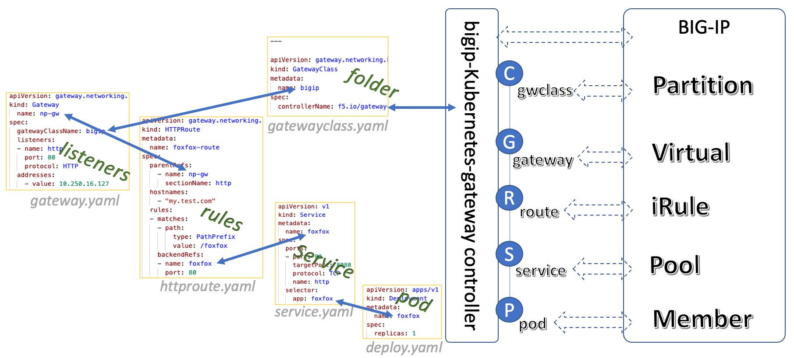

## Name

**Product Name**: BIG-IP Kubernetes Gateway Controller

**Code Name**: bigip-kubernetes-gateway

## Description

[**Gateway API**](https://gateway-api.sigs.k8s.io/) is an open source project managed by the SIG-NETWORK community. It is a collection of resources that model service networking in Kubernetes. These resources - GatewayClass,Gateway, HTTPRoute, TCPRoute, Service, etc - aim to evolve Kubernetes service networking through expressive, extensible, and role-oriented interfaces that are implemented by many vendors and have broad industry support.

**F5 BIG-IP kubernetes Gateway** is an implementation of Kubernetes Gateway API. It uses F5 BIG-IP as the [downstream implementation and integration](https://gateway-api.sigs.k8s.io/implementations/).

See https://gateway-api.f5se.io for more information.

Source code repository: https://github.com/f5devcentral/bigip-kubernetes-gateway.

## Quick view

BIG-IP Kubernetes Gatewway enables the conversion of GatewayAPI resources to BIG-IP ADC capabilities automatically:

## Code

 [Github f5devcentral](https://github.com/f5devcentral/bigip-kubernetes-gateway/tree/master)

## Installation

The installation process is simple, see https://gateway-api.f5se.io/quick-start/ for details.

## Usage

As the quick getstart, see https://gateway-api.f5se.io/Use-Cases/simple-gateway/.

## Support

For support, please open a [GitHub issue](https://github.com/f5devcentral/bigip-kubernetes-gateway/issues). Note, the code in this repository is community supported and is not supported by F5.

Maintenance and F5 Technical Support of this F5 code is provided only if the software (i) is unmodified; and (ii) has been marked as F5 Supported in SOL80012344, (https://support.f5.com/csp/article/K80012344).

Support will only be provided to customers who have an existing BIG-IP support contract associated with a valid BIG-IP serial number. For information about support policies, see http://www.f5.com/about/guidelines-policies/ and http://askf5.com.

## Roadmap

The bigip-kubernetes-gateway versions are released on dockerhub as [Docker images](https://hub.docker.com/r/f5devcentral/bigip-kubernetes-gateway/tags).

For a list of supported Gateway API resources and features, see the [Gateway API Compatibility](https://github.com/f5devcentral/bigip-kubernetes-gateway/blob/master/docs/gateway-api-compatibility.md) doc. Check [here](https://github.com/kubernetes-sigs/gateway-api#status) for Gateway API's latest status.

## Contributing

We are open to contributions, if

- you are interested in participating in our project and
- you have experience in kubernetes and golang development,
- BIG-IP related applications or development experience is preferred.

## Authors and acknowledgment

Contributors for now：

- [zongzw f5zong](https://github.com/zongzw)
- [Niklaus-xie](https://github.com/Niklaus-xie)
- [myf5 Jing Lin](https://github.com/myf5)