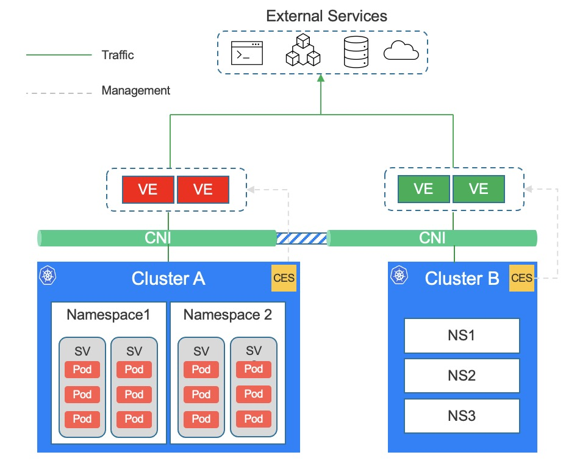

## Solution architecture

### Components

The CES solution includes the following components:

- CES controller: a container running in k8s. This component is the control plane, responsible for converting the outbound policies that deployed in k8s into the external data plane component(here is F5 AFM).
- F5 BIG-IP AFM: Data plane components running outside of k8s. Accept the configuration issued by the CES controller and execute specific access control rules, such as access control lists, bandwidth limiting, traffic programming, etc.
- CNI: CNI is a choice of the user environment itself and is not included in the CES plan. However, different CNIs will have different effects on the functions of the CES solution. Use [kube-ovn](https://github.com/kubeovn/kube-ovn/) CNI to get the full functionality of CES.

### Architecture diagram



### Policy scope and role

CES provides three policy scopes `cluster global` `namespace` and `service`. Its meaning and user role relationship are as follows:

| scope          | meaning                                                      | Adaptation role                                         |
| -------------- | ------------------------------------------------------------ | ------------------------------------------------------- |
| Cluster global | It is the global level policy of the cluster, which is used to control the general and overall access control of the cluster. For example, the cluster's access to basic public services such as NTP and DNS of the enterprise. The scope policy is applied to the outbound access control of all services in the cluster. | Cluster administrator, Security team                    |
| namespace      | This policy level is effective for a single namespace or project. It is used to control the access of all services in specific NS or project to access the services out of the cluster. Policies in different namespaces or projects do not affect each other. *This function requires the support of CNI. | Project team, application operation team                |
| service level  | The policy control the k8s servcies to the external services. Only valid for specific services. So if the CNI can not support namespace level policy, set svc level policy is an alternative way. | Project team, application operation, microservice owner |

### Tenant isolation

The CES solution supports strong isolation of `network + namespace`. Supports the administrative isolation of configuration objects on the data plane, and also supports strict traffic isolation at the network level. Support different namespaces to use overlapping CIDR.

```
Need CNI support network isolation. For example kube-ovn's per ns subnet
```

## Solution value

### Challenges solved

- High-frequency changes in outbound traffic caused by container IP dynamics
- Different role groups have different requirements for the scope setting of the policy, and the policy needs to match the role in multiple dimensions
- Dynamic bandwidth limit requirements for outbound traffic
- Protocol in-depth security inspection requirements
- Advanced requirements for flow programmable based on access control events
- Visualization requirements for outbound traffic

### Provided capabilities

- Dynamic IP ACL control with Cluster/Pod/NS granularity
- Cluster/Pod/NS granular FQDN ACL control
- Time-based access control
- Matched flow event trigger and programmable
- Matched traffic redirection
- Protocol security and compliance testing
- IP intelligence
- Traffic matching log
- Traffic matching visualization report
- Protocol detection visual report
- TCP/IP Errors report
- NAT control and logging
- Data flow visualization tracking
- Visual simulation of access rules
- Transparent detection mode
- High-speed log outgoing

```
Partial functions will evolve along with version iterations
```

**Next step:**

[Understanding CES installation](https://github.com/f5devcentral/container-egress-service/wiki/EN_2_CES_Installation)