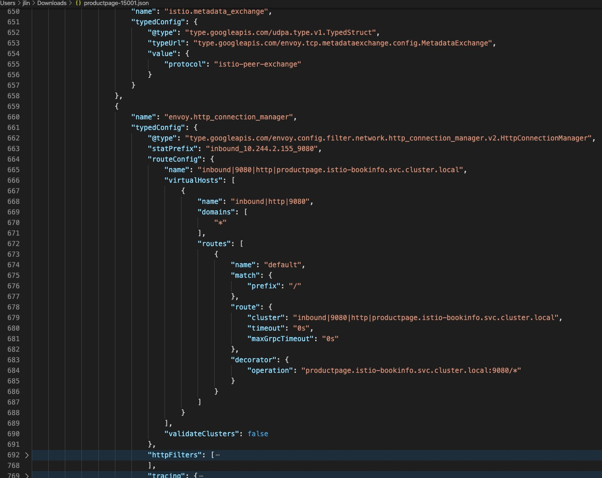
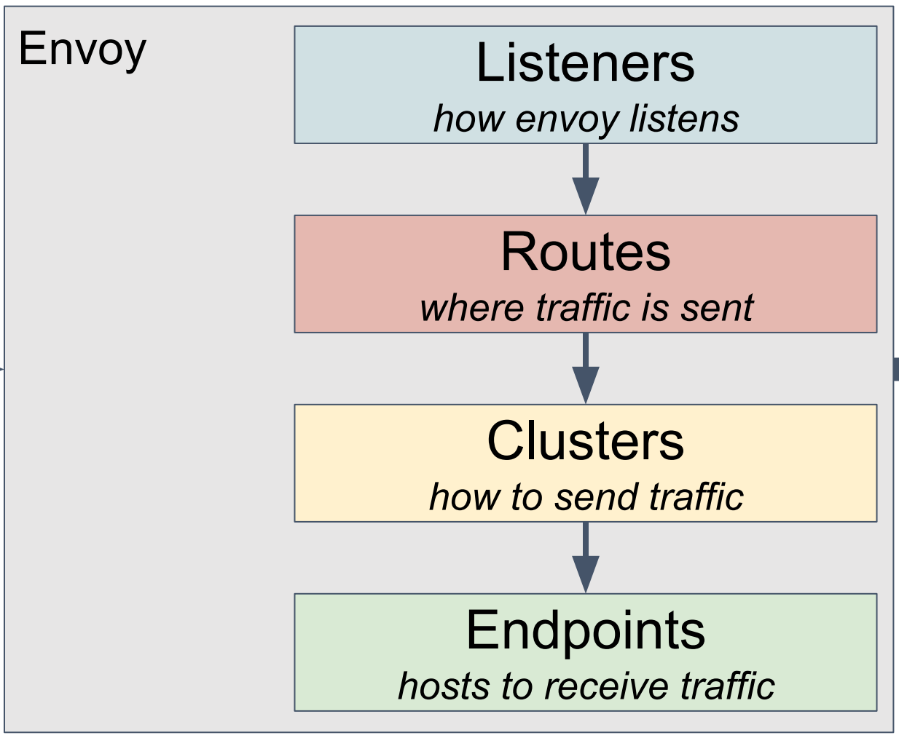
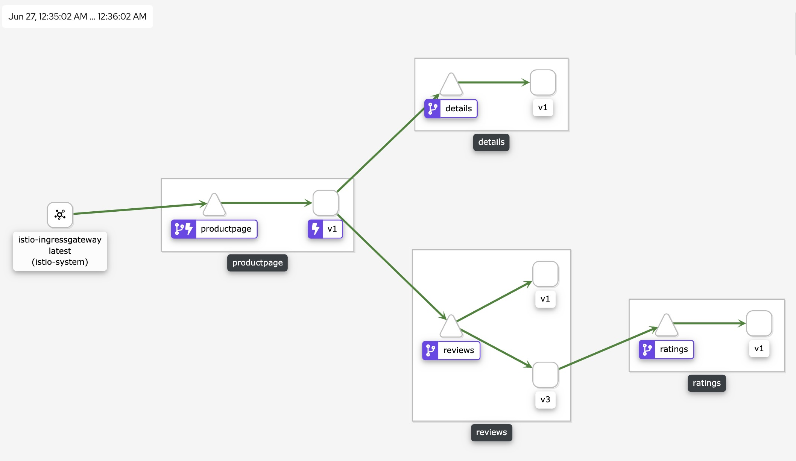
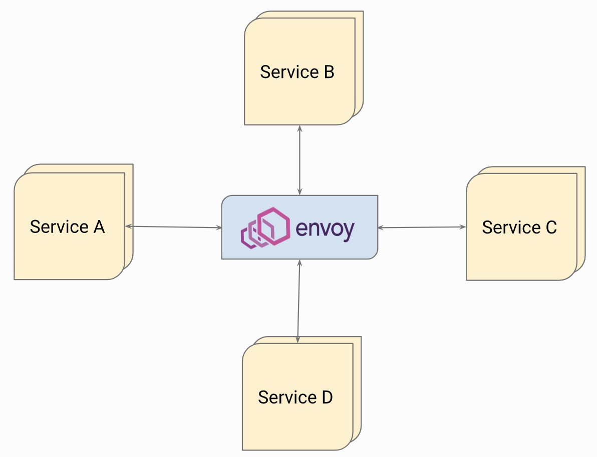
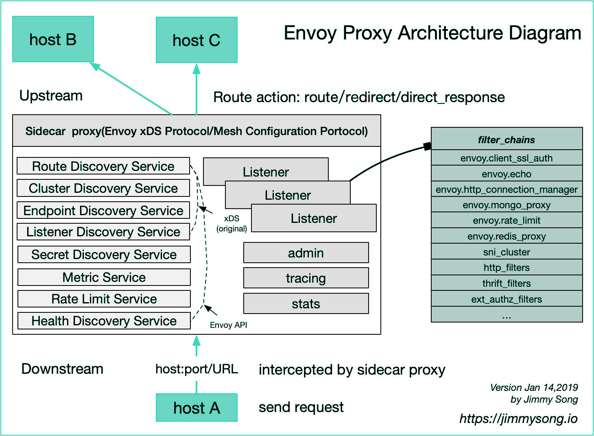
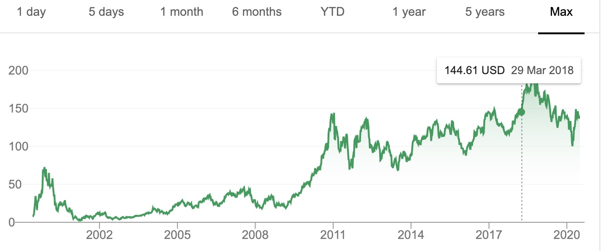
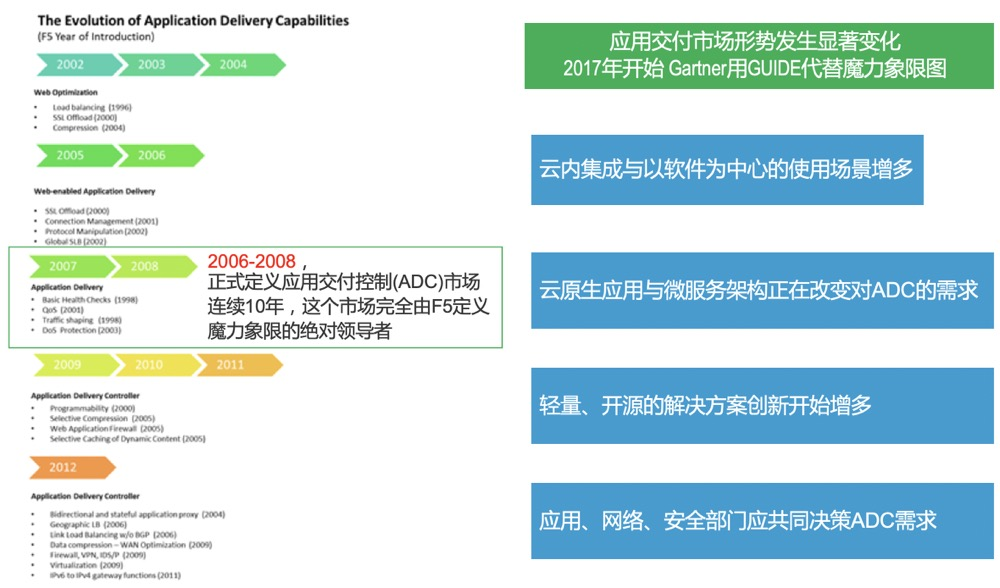

## Foreword

Envoy, messenger, envoy, representative! Just like the meaning of the word itself, with a sense of authority, a sense of sacred full agent. Combined with its own use and role, it is really "people as their name", can't help but like Lyft, I don't know which master got the name to get this name. In the current era of fiery microservices, Envoy is an absolute star, and it is no exaggeration to describe it as everyone knows. Someone once asked me how to look at Envoy and whether Envoy will replace F5 instead of NGINX in the cloud-native era. As a veteran who has experienced two waves of change in the field of application delivery technology, in this article I will talk about Envoy in the future From a perspective to understand and answer this question. Why talk a little bit, this is really not modesty, but objectively, there is really no such in-depth large-scale long-term use and research of all technical details of Envoy, so I will combine my professional experience and experience to make an Envoy Talk.

## Star-studded Envoy

First, let's take a look at how Envoy officially introduced Envoy:

> ENVOY IS AN OPEN SOURCE EDGE AND SERVICE PROXY, DESIGNED FOR CLOUD-NATIVE APPLICATIONS

From this description on the homepage of the website, we can clearly see the official definition of Envoy, which is simply a proxy for east-west, north-south traffic in the cloud native era. Lfyt is the pioneer of the microservice application architecture. We can see Lfyt in a large number of microservice sermon articles. After a large-scale shift from monolithic applications to microservice architecture, a serious problem was placed in development. In front of the architects, on the one hand, Lyft's services are developed in multiple languages, and the use of class libraries to solve various problems under the distributed architecture requires a lot of language adaptation and code intrusion. On the other hand, Lyft's business Both are deployed on AWS, relying heavily on AWS' ELB and EC2, but the traffic control, insight, and problem elimination between the services provided by ELB and AWS at that time could not meet Lyft's needs. It is based on this background, Lfyt is Envoy development started in May 2015. It was first deployed as an edge agent and began to replace ELB, and then began to be deployed as a sidecar method for large-scale deployment. On September 14, 2016, Lyft officially announced this project on its blog: Envoy C++ L7 proxy and communication bus . For a while, Envoy received a lot of attention, and companies such as Google began to contribute to this project, and donated the project to CNCF one year later in September 2017. With a good mom like Lyft, and the succession to CNCF as a rich dad, plus the half-brother Istio star brother's blessing, it can be said that Envoy has a good scene for a while, earning enough eyeball and developer support, I graduated from CNCF in just over a year.

Container technology has helped enterprises practice Devops and microservice transformation. The k8s container orchestration platform allows enterprises to move more business from traditional architectures to modern container-based infrastructures with more confidence. k8s solves container orchestration and applications. Issues such as publishing, but when the communication between services has changed from the previous call between memory to TCP-based network communication, the impact of the network on application services has become more huge and uncertain, based on traditional application architecture operation and maintenance The means cannot adapt and solve the huge and complex communication insights and troubleshooting between services. In order to solve such problems, the service mesh application was born and quickly became a hot topic of concern. The Istio project is the most important player in this ecosystem. Istio's architecture is a typical management plane and data separation architecture. The choice of data plane is open, but Istio chooses Envoy as the data plane by default. The two popular stars joined forces to make Linkerd eclipsed almost at the same time. At this point in time, NGINX also briefly carried out the Nginmesh project, trying to make NGINX as the data plane of Istio, but eventually gave up at the end of 2018, why did you give up, this article will be mentioned later.

In addition to Istio's selection of Envoy as the data plane, there are many projects based on Envoy, such as multiple Ingress Controller projects of k8s: Gloo, Contur, Ambassador. Istio's own Ingress gateway and Egress gateway also choose Envoy. Take a look at the Envoy users listed on their official homepage and say that starlight is not too much. Note that F5 in the list is very interesting.


(Envoy end user list)

## Envoy: born for the times

Below I will look at the technical aspects of why Envoy is so valued by the community. It will be summarized from the following aspects:

* Technical characteristics
* Deployment architecture
* Software Architecture
  
### Technical characteristics

 * Interface and API
 * Dynamic
 * Scalability
 * Observability
 * Modernity

#### Interface and API

When I first opened the configuration of Envoy, my first feeling was, God, how should such a product user configure and use. Under the intuitive experience, in an uncomplicated experimental environment, the number of lines of an Envoy's actual configuration file actually reached 20,000 lines.

```
#  kubectl exec -it productpage-v1-7f4cc988c6-qxqjs -n istio-bookinfo -c istio-proxy -- sh
$ curl http://127.0.0.1:15000/config_dump | wc -l
  % Total    % Received % Xferd  Average Speed   Time    Time     Time  Current
                                 Dload  Upload   Total   Spent    Left  Speed
100  634k    0  634k    0     0  10.1M      0 --:--:-- --:--:-- --:--:-- 10.1M
20550
```
Although this is a dynamic configuration in the Istio environment, although there are ways to optimize it to reduce the actual configuration amount, or that we will not do such a large amount of configuration when using the static configuration method for configuration, but when we see the following actual The configuration structure output will feel that for such a software, it is obviously impractical to configure and maintain in a normal way. Its configuration is completely json structured and has a large number of descriptive configurations. Compared to NGINX and other such reverse For agent software, its configuration structure is too complicated.


(Complex configuration structure)

Obviously, Envoy's design is not designed for manual, so Envoy designed a large number of xDS protocol interfaces, users need to design an xDS server to implement all configuration processing, Envoy supports gRPC or REST to communicate with the server to update Own configuration. xDS is the general name of the Envoy DS (discover service) protocol, which can be divided into Listener DS (LDS), Route DS (RDS), Cluster DS (CDS), Endpoint DS (EDS), and Secret DS in order to ensure consistent configuration DS-ADS of polymerization and the like, may be more xDS view here . These interfaces are used to automatically generate various specific configuration objects. It can be seen that this is a highly dynamic runtime configuration. To use it well, you must develop a server with sufficient capabilities. Obviously this is not the design thinking of traditional reverse proxy software.


(Picture from https://gist.github.com/nikhilsuvarna/bd0aa0ef01880270c13d145c61a4af22 )

#### Dynamic

As mentioned earlier, Envoy's configuration relies heavily on interface automation to generate various configurations. These configurations can be modified by Runtime without reloading files. In modern application architectures, the life cycle of a service endpoint becomes shorter and its operation Uncertainty or resilience has become greater, so the ability to make runtime changes to the configuration without having to reload the configuration file is particularly valuable in modern application architectures, which is an important consideration for Istio's choice of Envoy as the data plane. Envoy also has a hot restart capability, which makes it more elegant when an upgrade or a restart is necessary, and existing connections can be protected more.

In the Istio scenario, Envoy's container runs two processes, one called pilot-agent and one is envoy-proxy itself. The pilot-agent is responsible for managing and starting Envoy, and generates an envoy under /etc/istio/proxy/ -rev0.json Initial configuration file, this file defines how Envoy should communicate with the pilot server to obtain the configuration, and use this configuration file to finally start the Envoy process. However, the final configuration of Envoy is not only the content in envoy-rev0.json, it contains all the dynamic configurations discovered through the xDS protocol mentioned above.

```
#  kubectl exec -it productpage-v1-7f4cc988c6-qxqjs -n istio-bookinfo -c istio-proxy -- sh
$ ps -ef
UID         PID   PPID  C STIME TTY          TIME CMD
istio-p+      1      0  0 Jun25 ?        00:00:33 /usr/local/bin/pilot-agent proxy sidecar --domain istio-bookinfo.svc.cluster.local --serviceCluster productpage.istio-bookinfo --proxyLogLevel=warning --proxyComp
istio-p+     14      1  0 Jun25 ?        00:05:31 /usr/local/bin/envoy -c etc/istio/proxy/envoy-rev0.json --restart-epoch 0 --drain-time-s 45 --parent-shutdown-time-s 60 --service-cluster productpage.istio-bookin
istio-p+    142      0  0 15:38 pts/0    00:00:00 sh
istio-p+    148    142  0 15:38 pts/0    00:00:00 ps -ef
```
In the envoy overall configuration dump of the following figure, you can see that the contents of bootstrap and other static and dynamic configurations are included:


(Envoy configuration structure)

Combined with the following figure, you can see the basic Envoy configuration structure and its logic, whether it is an entrance listener (similar to F5's VS and part of the profile configuration, NGINX's listener and some Server paragraph configuration) or routing control logic (similar to F5 LTM policy, NGINX's Various Locations matching, etc., or Clusters (similar to F5 pool, NGINX upstream), Endpoints (similar to F5 pool member, NGINX upstream server), and even SSL certificates can be automatically discovered from the service side through the interface


(picture (From https://gist.github.com/nikhilsuvarna/bd0aa0ef01880270c13d145c61a4af22 )

#### Scalability

A lot of filters can be seen in the configuration of Envoy. These are the performance of its scalability. Envoy learned the architecture of F5 and NGINX, and used a lot of plug-ins to make it easier for developers to develop. From the start of listener, it supports the use of filter, and supports developers to develop L3, L4, L7 plug-ins to achieve protocol expansion and more control.

In practice, companies may not have as many C++ development reserves as languages ​​such as JavaScript, so Envoy also supports Lua and Webassembly extensions. This aspect eliminates the need to frequently recompile binaries and restart, and on the other hand reduces enterprise plug-in development. Difficulty, so that companies can use more Webassembly compatible languages ​​for plug-in writing, and then compile to Webassenmbly machine code to achieve efficient operation. At present, Envoy and Istio are still in the early stages of using Webassembly for expansion, and it will take some time to mature.


(Picture from https://www.servicemesher.com/istio-handbook/concepts/envoy.html )

As can be seen from the above figure, such a request processing structure is very close to the design idea of ​​the F5 TMOS system, and is similar to NGINX to a certain extent. Connections and requests correspond to different processing components at different protocol levels and stages, and these components are themselves extensible and programmable, which in turn enables flexible programming control of the data flow.

#### Observability

It is said that Envoy is born with the characteristics of cloud native. One of the characteristics is the emphasis on observability. You can see the three observable components: logs, metrics, and tracing are all supported by Envoy by default.

Envoy allows users to define flexible log formats in flexible locations in a flexible manner. These changes can be delivered through dynamic configuration to achieve immediate effect, and allows the definition of sampling of logs. In Metrics, it provides many indicators that can be integrated with Prometheus. It is worth mentioning that Envoy allows the filter itself to expand these indicators. For example, in the filter such as current limiting or verification, the plug-in itself is allowed to define its own indicators to help users better. Use and quantify the operational status of the plugin. In terms of Tracing, Envoy supports integration with third parties such as zipkin, jaeger, datadog, lightStep, etc. Envoy can produce a uniform request ID and keep it spread throughout the network structure. It also supports external x-client-trace-id to achieve A description of the relationship topology between microservices.



Each span generated by Envoy contains the following data:

 * Set by the --service-clusteroriginal service cluster information.
 * The start time and duration of the request.
 * Set by the --service-nodeoriginal host information.
 * By x-envoy-downstream-service-clusterdownstream cluster header set.
 * HTTP request URL, method, protocol and user agent.
 * By custom_tagsanother custom label settings.
 * The upstream cluster name and address.
 * HTTP response status code.
 * GRPC response status and messages (if available).
 * Error flag when HTTP status is 5xx or GRPC status is not "OK".
 * Track system-specific metadata.

#### Modernity

In fact, it is obviously correct nonsense to say that Envoy has modernity. Envoy was born for modern application architecture. Here we mainly want to explain from several aspects that we can most easily feel. The first is its special structural design. In Envoy, it supports the use of iptables to intercept the traffic and do transparent processing. It can use getsockopt () to extract the original destination information in the NAT entry, and allow listeners to listen on the listener. The transferred port listener jumps to an unbound listener that actually matches the original destination information. Although from the perspective of a reverse proxy, this is a bit like F5's VS internal jump, NGINX's subrequest, but its biggest feature and ability lies in transparent connection, which is especially important in the deployment Pod sidecar mode, refer to specific principles herein .

For the gray-scale publishing, traffic mirroring, circuit breaker, global current limiting and other functions that are favorite for modern applications, its configuration is also very simple. Although F5/NGINX and other software can also accomplish similar tasks, they are native Envoy has greater advantages in terms of ease of configuration and ease of configuration.

Another manifestation of modernity is the support of the protocol. Look at the following supported protocols. Students who are familiar with application delivery and reverse proxy software may not help but express their admiration. The support of these protocols on the other hand shows Envoy’s A feature that is more oriented towards developers and SRE.

 * gRPC
 * HTTP2
 * MongoDB
 * DynamoDB
 * Redis
 * Postgres
 * Kafka
 * Dubbo
 * Thrift
 * ZooKeeper
 * RockeMQ

### Deployment architecture

After understanding the technical characteristics of Envoy, let's look at Envoy from the perspective of deployment architecture.

Complete Sidecar model deployment, which is the biggest deployment feature of Envoy. The communication between services is completely transformed into the communication between Envoy agents, so that many non-business functions are removed from the service code to external proxy components. Envoy is responsible for network communication control Observable with flow. It can also be deployed as a simplified sidecar, which only acts as a proxy for the inbound direction of service without additional traffic manipulation. This structure is used in the external observability based on NGINX to achieve business observability


Hub type, which is the same as the Router-mesh type concept in NGINX's MRA. All services use a centralized Envoy to communicate. This deployment structure is generally suitable for small and medium-sized services. Service flow can be directed by adapting to service registration. To Envoy


Envoy can also be used as an Ingress edge gateway or Egress gateway. In this scenario, Envoy is generally used for Ingress controller or API gateway. You can see that many such implementations like to use Envoy as the underlying layer, such as Gloo, Ambassador, etc.


The following deployment structure should be familiar to everyone. As an Edge gateway, Envoy also deploys an additional layer of microservice gateway (or proxy platform layer)


Finally, this is to integrate all forms of Envoy deployment. This architecture may be in the middle of the process of migrating services from traditional architecture to microservice architecture


Ok, take a look at how Envoy is used in Istio


In summary, due to the cross-platform nature of Envoy, it has the same flexible deployment structure as NGINX, but in fact the deployment structure often has a strong relationship with the final configuration implementation mechanism, can the software's ability adapt to the flexibility under this structure Implementation with simple configuration is the ultimate test. Objectively speaking, Envoy has an advantage in this respect.

### Software Architecture

Envoy adopts a single-process multi-thread design structure, and the main thread is responsible for configuration updates and process signal processing. Requests are handled by multiple worker threads. In order to simplify and avoid processing complexity, a connection is always handled by one thread, which can minimize some lock operations caused by data sharing between threads. Envoy avoids state sharing between threads as much as possible, and designed the Thread Local Store mechanism for this purpose. In the log writing, the worker thread actually writes to the memory cache, and finally the file refresh thread is responsible for writing to the disk, which can improve efficiency to a certain extent. Overall, Envoy is still more focused on simplifying complexity and emphasizing flexibility, so unlike NGINX, it does not put the pursuit of performance in the first place, which can be obtained in the relevant official blog of Envoy verification.


Similar to NGINX, Envoy is an asynchronous, non-blocking design, using an event-driven approach. Each thread is responsible for each listener, SO_REUSEPORT can also be used to share sockets, NGINX also has a similar mechanism.


After the listener listens and starts processing, the connection will be processed by subsequent L3, 4, 7 and other filters according to the configuration.



## F5/NGINX: the sword is not out

After understanding the technical characteristics and architecture of Envoy, we return to the original point of this article. Envoy has been carrying the genes of modern application architecture from birth, does it mean that these front waves such as NGINX/F5 are out of date.

I remember the author of NGINX, Igor, at the F5 China 520 conference to explain why NGINX is so successful. He said that he did not expect to be so successful because the reason is that he developed the right software at the right time. We know that during the period around 2003, there was still no talk about distributed architecture and microservices. At that time, the main problem to be solved was stand-alone performance. Based on this background, NGINX is strict in terms of architecture design and code quality. Demanding performance. In terms of functionality, NGINX was originally a Web Server software, L7 reverse proxy is an extension of its capabilities, and L4 proxy capabilities increase even later. In view of this background, from the perspective of modern application architecture, there are indeed some Capability is more difficult to cover. Similarly, Envoy was born and developed in the era of modern application architecture. As Envoy self-explained, it refers to a large number of existing hardware and software reverse proxy and load balancing products. From the above technical analysis, it can also be seen that Envoy has many NGINX and F5 Architectural concept, it can be said that Envoy draws many essences from mature reverse proxy products, and fully considers the needs of modern application architecture when designing, it is also a correct software at the right time.

Under the microservices architecture, many problems have become how to control the communication and traffic insights between services. This is a typical application delivery field. As a frontier in this field, on the one hand, we must actively embrace and adapt to the new era of application architecture. On the one hand Need to innovate and continue to lead new directions. There have been two technological innovations in this field in history. The first was around 2006, when the topic of "load balancing was dead" was fired. The essence was that the market began to change at that time, and everyone was no longer satisfied with simple loads. Balanced, demand is derived from more complex scenarios such as application security, network optimization, application optimization, access control, and flow control. The concept of application delivery began to be proposed. It can be said that before 2006, the main concepts and technical directions of the market were based on The four-layer switch is the core concept of load balancing technology. Most players are traditional network manufacturers. The thinking and concepts are based on network switching. F5 is like a strange guy. The product design thinking is completely on another dimension. The TMOS V9 operating system, which has been released since 2004, has led the market since then, and no one has surpassed it for 10 years thereafter. The second technological innovation occurred around 2016. Affected by the cloud and microservices, software and lightweight became the mainstream of the market. At the same time, Devops thought means that the role of users has changed. The traditional design for network operation and maintenance personnel It began to become difficult to meet market demand. The field dominated by F5 has also undergone new changes in the market. Gartner no longer publishes magic quadrant analysis in the field of application delivery, and instead forms guidance in the way of Guide.



Looking at the present, history is always surprisingly similar.

The modern application architecture is developing rapidly, and a large number of applications are beginning to be micro-serviced. However, from the perspective of the overall chain of business access, Envoy cannot solve all problems, such as application security protection, complex enterprise protocols, and different needs caused by different organizational relationships. It can be seen that the application delivery products represented by F5/NGINX have also begun to actively realize product integration under the Devops tide. F5 has released a complete automated tool chain, from the product’s bootstrap to network configuration, to application service configuration, to the final Monitoring and telemetry have formed a complete interface, and use declarative interface to promote product management to a higher role crowd and management system. NGINX also builds its own API and Controller plane, and provides a declarative API interface to the outside world. Developers can better use the interface to integrate into their own control plane. These changes are for developers or SRE to better use F5/NGINX. For details, please refer to my "From Traditional ADC to Cloud Native ADC" [series of articles](https://mp.weixin.qq.com/s?src=11&timestamp=1593224168&ver=2425&signature=znUdlLDdpbGGxWX7pZhH2uSVq1SAdQuloO09HIXssdQ15nRtWVOIgzlYTFmjOIUsDrqghPbSZM6vQI45TIqmINQKjposI7AfJ6jKQaEXm9KD4tEV5Bk9AF0RGuKvVuHI&new=1).



After acquiring NGINX and Shape, F5 put forward a new view that will make full use of the widely accessible data plane capabilities, and use AI to further tap the data potential to help users better grasp and understand application behavior and performance, and provide references for business operations. , And feedback to component configuration and operation management to form a closed loop.

An important scenario for modern application delivery is still indispensable, that is, application security. Although Istio and other products have made many attempts in secure communication, identity, and strategy, application security itself is relatively lacking. F5 is a leading manufacturer in the field of WAF security Through the transfer of security capabilities to NGINX, a new NGINX APP Protect is formed, which uses its cross-platform capabilities to help users better manage application security capabilities in microservice scenarios and help enterprises better implement DevSecOps.

If we compare the technical features of Envoy with F5, we can see that F5 lacks scalability and modernity to a certain extent. F5 has good programming control capabilities, but it is relatively larger than the development of larger plug-ins. Insufficient, this and modernity can often be linked together. For example, if you want to make a complex 7-layer filter similar to Envoy for a very new protocol, it is impossible to achieve, although iRule or iRuleLX can do something to a certain extent. However, in any case, the final product form of F5 itself determines that F5's BIGIP cannot be completely cross-platform, because it cannot run as a container. It is worth expecting that such morphological restrictions will be broken by F5's next-generation TMOS system.

Service Mesh is the current popular technology direction. F5 builds an enterprise-level Aspen Mesh service mesh product based on Istio, which helps enterprises deploy and use Istio better and easier. Aspen mesh team members enter the Istio Technical Oversight Committee with only 7 positions and are responsible for the important responsibilities of Istio's RFCs/Designs/APIs. Although Istio has absolute ecology and popularity in the field of service mesh, this does not mean that Istio is the only choice. In many cases, customers may want to adopt a more concise Service Mesh to achieve most of the required functions instead of deploying one. The entire complex Istio solution, NGINX Service Mesh (NSM) based on NGINX components will bring new choices to users, a more simple and easy to use Service Mesh product, this is the reason why we mentioned NGINX to terminate Nginmesh at the beginning of the article .

## Conclusion

Technology development is an inevitable process. In 2006, it evolved from traditional load balancing technology to application delivery. In addition to load balancing, it introduced many aspects such as security, access control, access control, and flow control. Around 2016, new technological changes have occurred in this field again. The emergence of a large number of new generation reverse proxy open source software has a new impact on traditional application delivery products. Active adaptation and change and innovation are the key to winning. Envoy has excellent capabilities as a new representative, but it is not a silver bullet to solve all problems. Envoy has a steeper learning curve and higher development and maintenance costs. For enterprises, they should choose the appropriate solution and Products to solve different problems in the architecture, to avoid catching the trend and let yourself fall into the trap.

F5 needs more to let developers understand the huge potential of TMOS system (especially the subversion of the next generation products in architecture and form), understand its excellent all-agent architecture and program control at any level, so that developers, SRE develops with F5 TMOS as a capability platform and middleware, and better utilizes F5's own application delivery capabilities to quickly realize its own needs.

Finally, again quote a sentence from the homepage of the official Envoy website:

> As microservice practitioners soon realized, most of the operational problems that arise when moving to a distributed architecture are ultimately based on two aspects: network and observability.

And to ensure more reliable network delivery and better observability is the strength of Qianlang. Innovate, Qianlang.

Written at the end: No matter how the technology changes, the human factor is still the core, regardless of the company or the manufacturer, in such a wave of technology, it should have sufficient technical reserves, just like the traditional financial industry through the establishment of technology companies to seek transformation, Manufacturers also need to be transformed. F5 China's SE has almost 100% passed the CKA certification. Regardless of the relative proportion or absolute number, it should be unique in the industry. The transformation is not only in products, but also in thinking.


Check more istio practice detail at my tech blog https://imesh.club